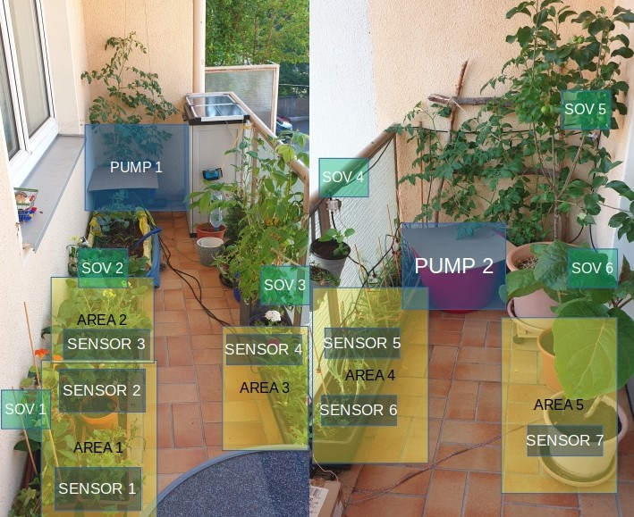

# Plant watering and monitoring system (FreeRTOS in STM32F4)

This is the code repository for a hobby plant watering and monitoring system.
The hardware used is a [STM32F407VET6](https://stm32-base.org/boards/STM32F407VET6-STM32-F4VE-V2.0.html) development board with a [W25Q16](https://www.digchip.com/datasheets/parts/datasheet/523/W25Q16.php) external flash memory.
FreeRTOS is used as the operating system and initial code was generated with STM32CubeMX/IDE. External flash driver is from [nimaltd](https://github.com/nimaltd/) Thanks:)

The idea of the project is to have an easily configurable system that can be adjusted to the user specific needs.
The system generates the control signals for turning on/off water pumps and solenoid valves at specific time intervals
but it can also take soil moisture levels into consideration
and actuate only when a determined threshold is crossed.

The time and duration of watering, as well as a timestamped moisture level (ADCs voltage) 
and ambient temperature (I2C with DS3231) are saved into the external flash.
They can be retrieved through SPI commands to STM32.

The NodeMCU is used to facilitate retrieving the stored data, as well as to send new configuration settings.
The code for NodeMCU and the client script, is kept in another code repository, [check here](https://github.com/kadway/nodemcu-micropython-plant-monitor)

Several different watering areas can se configured, each with its associated moisture sensors (ADC channels), water pump and solenoid valves.

####  Usage/Setup example


##### Hardware used

- STM32 Dev board
- NodeMCU
- Water pumps
- Solenoid valves
- Capacitive soil moisture sensors
- 12Vdc and 5vdc power supply
- 1 MOSFET for each water pump and for each solenoid valve (for switching the 12Vdc supply)
- 1 MOSFET for switching on the capacitive sensors 5Vdc supply

##### Prototype board


#### To use this code

You should have the [STM32F407VET6](https://stm32-base.org/boards/STM32F407VET6-STM32-F4VE-V2.0.html) development board or similar as well as a JTAG/SWD programmer.
For development I'm using the STM32CubeIDE and an STLink-V3 debugger/programmer.

In case you don't use same development board, note that an external flash memory is necessary for storing the configurations and logged data.
To run on other STM32 MCUs some adaptations may be necessary due to IO or peripheral amount, but so far it was not tested.

You can compile the code using the STM32CubeIDE which is free and based on eclipse, runs well enough on linux Ubuntu and Mint (that I have tried).
For programming OpenOCD is also an alternative to the STLink.

##### Schematics

##### MCU PIN assignments

#### System description - FreeRTOS tasks
* ADC conversion task (for soil moisture measurements), a periodic task, delayed with the value of ```adcConvTimeInterval```), saves the measurements to the external flash as well as actual RTC time
* Communication task, real time priority task, normally locked by a semaphore which is given only when a new SPI transfer is complete
* Control task, a periodic task, which checks for each configured area, when configured in open loop, if the time interval for watering has passed,
or, when in closed loop, if the last moisture measurement is higher than the configured threshold. When the particular area needs watering,
the control task puts this area configuration in a queue of areas to be watered by a specific watering pump.
1 queue for each watering pump is created and the queue size is the amount of watering areas that have the same associated water pump.
* Actuation task (one for each existing pump), waits for a new message in the queue, actuates the water pumps and solenoid valves for the configured amount of time, creates a software timer for this purpose.
This task saves the information of which area was watered and the time from RTC to the external flash.

#### Configuring the system

After first boot the system will configure default settings and run on 'open loop' mode (watering is done based on configured watering interval).
To consider soil moisture values for watering of a specific area, the mode should be configured to 'closed loop' and an appropriate threshold value configured.
These and other settings can the be updated through SPI commands to the STM32. (check the repository [here](https://github.com/kadway/nodemcu-micropython-plant-monitor))

##### Configuration structures

There are two main data structures created for the configuration of the system:

* Genereal configuration

```C
typedef struct generalConfig{
	uint32_t adcConvTimeInterval;   //interval for ADC readings (seconds)
	uint16_t initCode;              //Bytes for checking default initialization
	uint16_t pageAdc;               //last page number where readings from sensors was written
	uint16_t pageAct;               //last page number where actuation log was written
	uint16_t pageOffsetAdc;         //page offset in bytes for writing to external flash memory
	uint16_t pageOffsetAct;         //page offset in bytes for writing to external flash memory
	uint8_t nArea;                  //number of watering areas
	uint8_t nSens;                  //number of moisture sensors
	uint8_t nPump;                  //number of water pumps
	uint8_t nSov;                   //number of solenoid valves
}gConf_t;
```

* Areas configuration
```C
typedef struct wArea{
	uint8_t sensID[MAX_N_SENS]; //ids of associated sensors in the watering area
	uint8_t sovID[MAX_N_SOV];   //ids of associated solenoid valves in the watering area
	uint32_t wateringDuration;  //watering duration (seconds)
	uint32_t wateringInterval;  //watering interval for open loop (seconds)
	uint32_t lastWateringtime;  //last time of watering (value of Sys Tick)
	uint16_t threshold;         //threshold for closed loop watering control
	uint8_t pumpID;             //id of the pump watering this particular area
	uint8_t openLoop;           //to consider the threshold or not
	uint8_t areaID;             //number for the area to be watered
}wArea_t;
```

It advised to read first the actual configuration and write the new one by modifying the original.
The following variables should **not** be changed when setting a new configuration:

```C
    uint16_t initCode;     //this is a code for preventing the mcu to write new default configurations to the flash, if changed, all external flash data including configurations will be erased after new boot up
	uint16_t pageAdc;      //last page number where readings from sensors was written
	uint16_t pageAct;      //last page number where actuation log was written
	uint16_t pageOffsetAdc;    //page offset in bytes for writing to external flash memory
	uint16_t pageOffsetAct;    //page offset in bytes for writing to external flash memory
	uint32_t lastWateringtime; //last time of watering (value of Sys Tick)
```

General configuration should be sent first as it will stop the main control task and take in consideration the new number
of areas ```uint8_t nArea;``` (to calculate required amount of data that must be received), then the areas configurations can be sent.
One data structure per desired watering area must be configured and sent sequentially.
For each watering area, each sensor that is present in it must be given in the static array ```sensID```.
It must be a number between 1 and nSens. This number will correspond to the ADC channel to be used (ADC channel 0 - sensID 1). 
A value of sensID = 0 is considered not existing. Same principle for each solenoid valve that enables the water path to a particular area. It should be a number
between 1 and MAX_N_SOV and sovID=0 is considered not existing. Each area has also an associated water pump number. When the pump number is set to 0,
no watering control is done for this area (this does not affect any moisture sensor measurements that are associated to the area).

------

#### Contributing
If you find the project interesting and would like to contribute feel free to send a pull request.
I'm also open for suggestions if you have ideas for To-Do's.

#### To do:
* Complete/extend the communication task with additional commands (configure rtc... etc)
* Consider that the flash sectors for the logged data (moisture and watering times) have to be erased in case they need to be overwritten